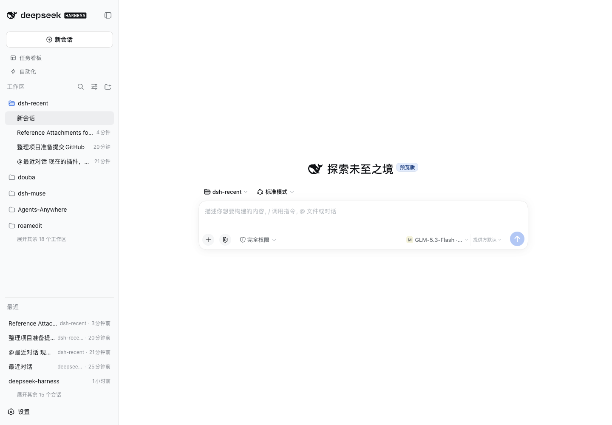

# dsh-recent

English | [简体中文](README.md)

A DSH Web GUI plugin that adds a **Recent** section to the left sidebar, below
the workspace list: the newest sessions of every workspace flattened into one
time line. Browse projects by folder on top, jump back into the latest work
below.



## Why

Codex's sidebar has two views: projects (folders) and recent (a time line). DSH
ships only the project view — to get back to the session you were just in, you
have to remember which workspace it belongs to, then expand that folder.

This plugin adds the second view: every workspace's newest sessions sorted by
activity, each row showing the title, its workspace and its age, one click to
open. Running sessions show a state dot, the current session is highlighted, and
both the workspace list and the recent list fold to five rows.

## Features

- **Flat time line** — newest sessions across all workspaces, up to 20
  candidates, independent of how the workspace list is folded.
- **Consistent visibility** — the same rules as the workspace tree: archived
  sessions are hidden, subagent sessions belong to their parent's catalog, and
  blank provisional sessions never appear (they hold no history).
- **Live state** — a yellow dot while a session waits for you (approval,
  question, plan review), a pulse while it runs, and the row of the current
  session highlighted.
- **Paired folding** — the recent list and the workspace list each fold to five
  entries behind an identical `Show N more …` row; expanding is a temporary
  state, so collapsing the sidebar and reopening it returns to the folded
  default, as in Codex.
- **Native look** — `--dsw-*` semantic tokens plus the shell's own `StateDot`
  and triangle icons, so light/dark and every brand theme follow the shell; the
  two fold rows match the shell's own session overflow control exactly.
- **No shell source changes** — the recent section registers into the sidebar's
  long-standing `sidebar.footer.action` list slot; the workspace list offers no
  slot or service for folding, so that half is applied at the DOM level (see
  Design notes). DSH's front end is neither patched nor rebuilt.

## Install

From the profile that runs your GUI (usually `~/.dsh/profiles/web`), install
from GitHub:

```sh
dsh plugin --profile web add github:ttmouse/dsh-recent
```

Or point at a local clone while working on the plugin (`link:` follows your
edits):

```sh
dsh plugin --profile web add link:/path/to/dsh-recent
```

Either way the command writes the dependency into the profile's `package.json`
and appends `dsh-recent` to `dsh.profile.bundles`. Doing both steps by hand
works too:

```json
{
  "dependencies": { "dsh-recent": "link:/path/to/dsh-recent" },
  "dsh": { "profile": { "bundles": ["…", "dsh-recent"] } }
}
```

Then restart `dsh web` and reload the page — the bundle list is read at startup,
and hot reload only covers source changes of plugins that are already loaded:

```sh
# stop the running dsh web, then
dsh web
```

## Development

```sh
pnpm install
pnpm run typecheck   # tsc --noEmit over src + tests
pnpm test            # unit tests; also checks lib/client.js's loader contract once built
pnpm run build       # lib/index.js + lib/invariant.js + lib/client.js + lib/types
```

`lib/` is committed, and the host serves `lib/client.js` rather than the source,
so re-run `pnpm run build` after every source change. CI rebuilds and fails if
the committed `lib/` drifts from a fresh build.

## Design notes

- **Seat** — `sidebar.footer.action` is a list slot declared by
  `@deepseek-ai/dsh-client-ui-sidebar`, rendered exactly between the workspace
  tree and Settings. Narrowed to the 56px rail (`wide: false`) the section
  renders `null`: a list has no meaning in the icon rail.
- **Data** — sessions and workspaces come through the framework standard kit
  (the registration's own `useSessions` / `useWorkspaces` selector hooks), and
  opening a session goes through the `open` callback injected at registration;
  the component subscribes to no external source.
- **Opening** — prefers the newer shell's `uiWorkspace.openSession`, which also
  clears the center panel's selection, and falls back to `ctx.sessions.open`.
- **Relative time** — the same buckets as the workspace tree (now / Nmin / Nh /
  Nd / Nmo / Ny), refreshed every 30 seconds, so one session reads the same age
  on both surfaces.
- **Folding the workspace list** — the shell renders one `_groupSection` per
  workspace and exposes no "show fewer" affordance, slot, store or config field,
  so the plugin applies it from the outside: every group past the fifth gets
  `display: none` and a fold row is inserted after it. React rewrites the list on
  every frame, so a `MutationObserver` on `document.body` re-applies the fold,
  comparing before writing so its own writes never feed it; the callback filters
  records to sidebar mutations first, so conversation streaming never reaches
  `apply()`. The container is resolved as the parent of the first rendered
  `_groupSection`, which leaves the flat/search rendering (no group wrappers)
  untouched.
- **Folding is temporary state** — no store: the expanded flag lives in the
  component, so collapsing the sidebar and reopening it (`wide` false → true)
  returns both lists to the five-row default.
- **Natural height** — the section never scrolls internally and reserves no
  fixed bottom block: it is exactly as tall as its rows and hangs right below
  the workspace list. When the column runs out of room, the workspace tree's
  own scroll area absorbs the squeeze (`regionArea` is a flexible
  `min-height: 0; overflow: hidden` region).

## Known limitations

- **Wide column only** — the 56px rail renders no recent section (an entry that
  deserves a rail cell should be a `sidebar.panellist` panel instead).
- **Workspace folding depends on the shell's DOM** — it keys off the
  `_groupSection` / `_footArea` CSS-module suffixes and the first group's parent.
  If the shell renames or restructures them the fold silently stops applying
  (degrading to the shell's full list) instead of failing loudly. The fold counts
  workspace groups, not sessions.
- **Fold, not reorder** — workspace order stays the list's own (newest first,
  plus manual ordering); the plugin does not re-sort by recent activity, which
  would require changing the shell's list order upstream.
- **20-row cap** — five rows are visible while folded; older history belongs to
  the workspace tree or search.
- **No search, no context menu** — rename / archive / fork stay in the workspace
  tree.
- **A title-less session shows its id** — titles are projected by the host from
  the log; for old sessions without one the row falls back to `displayTitle`
  (usually the project directory name or the session id).

## License

[MIT](LICENSE)
