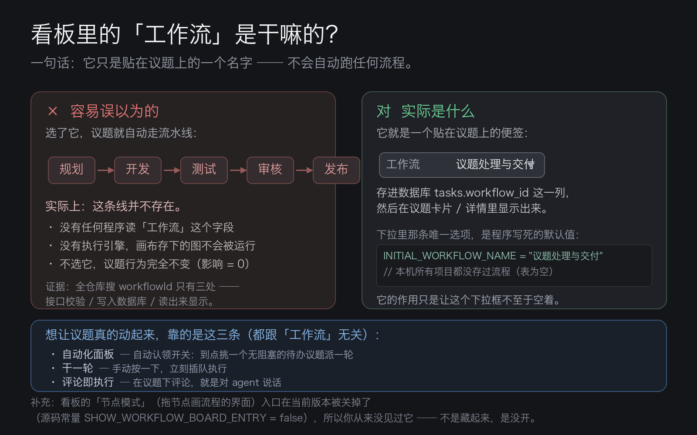

# 看板里的「工作流」到底是什么？（大白话版）

> 结论先说：**它是一个「给议题分类的标签」，不是一条会自动跑起来的流水线。**
> 你现在什么都不用做——不选它，议题照常工作；选了它，也只是多存了一个名字。



上面这张图就是你在「新建议题」弹窗里看到的位置：底排第三个控件，图标是个小方块，
点开只有一个选项「议题处理与交付」。下面把它的来龙去脉说清楚。

---

## 一、它是什么：一个贴在议题上的名字

在**新建议题 / 编辑议题**的弹窗里，那一排控件是议题的「属性」：

| 控件 | 存的是什么 | 有什么用 |
| --- | --- | --- |
| 等待认领 | 状态 | 决定议题在哪个列 |
| 无优先级 | 优先级 | 排序、自动认领时优先挑谁 |
| 本地用户（我） | 负责人 | 给谁看 |
| 标签 | 标签 | 筛选 |
| **工作流** | **一个流程名字** | **见下文——目前只是记录** |
| 分支 / Worktree | 代码目录 | 让 agent 在哪个目录干活 |

「工作流」这一格，做的唯一一件事，是把一个**流程名字**记到这条议题上。
数据库里对应 `tasks.workflow_id` 这一列（一个文本字段），议题卡片、
议题详情页都会把它显示出来。

**打个比方**：它像给文件贴的一张便签，写着「这份属于 A 流程」。
便签本身不会让文件自己动起来。

## 二、它不会自动干什么（这点最容易误会）

名字叫「工作流」，很容易让人以为选了它之后，议题会自动经历
「规划 → 开发 → 测试 → 审核 → 发布」这样一串步骤。**目前不会。**

我用议题编号在插件源码里逐个查过，结论是有依据的：

1. **没有任何程序读它。** 全仓库搜索 `workflowId`，只有三处出现：接口校验、
   写入数据库、读出来显示。没有第四处——**不存在**「读到 workflowId 就触发某个动作」
   的代码。
2. **没有执行引擎。** 搜遍服务端与共享代码，找不到 `runWorkflow` / `executeWorkflow`
   之类的函数。编排画布存下来的是一张图的数据，**没有任何东西去「运行」这张图**。
3. **这个项目里一条流程都没存过。** 直接查本地数据库：

   ```
   $ sqlite3 ~/.dsh/storages/dsh-taskboard/taskboard.sqlite \
       "select project_id, version from workflow_workspaces;"
   (无输出)
   ```

   所有项目的流程都是空的。所以你在下拉框里看到的「议题处理与交付」，
   不是你自己建的，而是**程序自带的一个默认占位选项**——源码里写死的：

   ```ts
   // web/src/workflowStore.ts
   export const INITIAL_WORKFLOW_ID = "issue-delivery";
   export const INITIAL_WORKFLOW_NAME = "议题处理与交付";
   export const DEFAULT_WORKFLOW_OPTIONS = [
     { id: INITIAL_WORKFLOW_ID, name: INITIAL_WORKFLOW_NAME },
   ];
   ```

   它的作用是：让这个下拉框**不至于是空的**。仅此而已。

## 三、那看板里那个「节点模式」画布呢？

README 里写着看板有「工作流」视图，源码里也确有一整套流程编排界面——
一个可以拖节点、连线、配置触发器的画布（`WorkflowBoard.tsx`，
带触发器、条件判断、调用 Skill、Git 操作、飞书、部署等节点）。

但有两点要知道：

- **入口当前是关闭的。** 源码里有一个开关，值是 `false`：

  ```ts
  // web/src/App.tsx
  const SHOW_WORKFLOW_BOARD_ENTRY = false;
  ```

  所以看板顶部那一排视图标签里，**你只看到「仪表盘 / 议题看板 / 列表视图 / 甘特图」**，
  没有「节点模式」。这就是你「从来没见过、从来没用过」的直接原因——
  它不是一个藏起来的功能，而是**被主动关掉了**。

- **就算打开，也只是画图。** 画布能建流程、能保存（存进
  `workflow_workspaces` 表，自动保存），但没有执行引擎，画完不会真的跑。

所以准确的说法是：**流程编排是一套「画好了、但还没通电」的功能。**

## 四、对你的实际影响：零

- 不用管它，不选也不影响任何事；
- 选了也只是存个名字，不会让议题发生任何额外动作；
- 你的议题之所以能自动推进，靠的是**另一套机制**——「自动化」面板里的
  **自动认领**开关：到点由看板挑一个无阻塞的待办议题，派一轮给 agent；
  以及你手动按的**「干一轮」**和**评论即执行**。这三条都不依赖「工作流」字段。

一句话：**想让议题动起来，去碰「自动化」和「干一轮」；
「工作流」这一格，现在可以放心无视。**

## 五、如果你以后想用它

等这个功能将来真的接通执行引擎（把画布上的流程和议题上的
`workflowId` 连起来，让议题真的按图走），那时它的用法会是：

1. 打开「节点模式」视图，新建一条流程，拖节点、连成一条线；
2. 在流程里放一个「议题触发器」，设定什么条件触发（如状态变为待办）；
3. 建议题时，在「工作流」下拉里选中这条流程。

在此之前，这个下拉框只有「议题处理与交付」一个选项，
选与不选都没有区别。

---

## 附：本结论的核对方法

想自己复核，逐条跑：

```bash
cd ~/Projects/dsh-taskboard

# 1. 谁在读 workflowId？（预期：只有校验、写入、读取显示，无执行逻辑）
grep -rn "workflowId" server/*.mjs | grep -v vendor

# 2. 有没有执行引擎？（预期：无输出）
grep -rn "runWorkflow\|executeWorkflow" server/ shared/ web/src/

# 3. 节点模式入口开着吗？（预期：false）
grep -n "SHOW_WORKFLOW_BOARD_ENTRY" web/src/App.tsx

# 4. 本机存过流程吗？（预期：无输出）
sqlite3 ~/.dsh/storages/dsh-taskboard/taskboard.sqlite \
  "select project_id, version from workflow_workspaces;"
```
